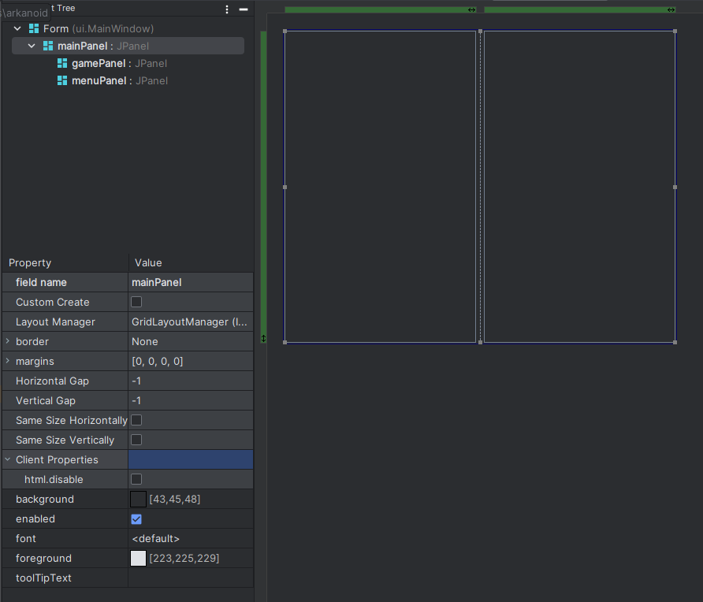
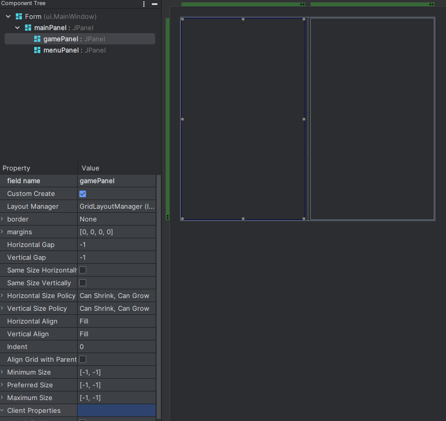
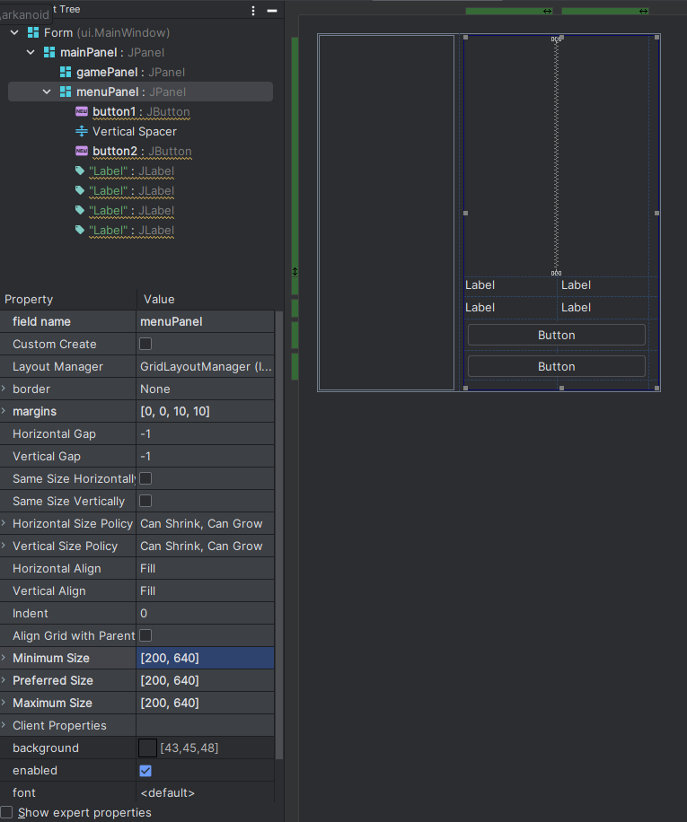

## MainWindow <Badge type="tip" text="Nuevo" vertical="middle" />

Como primera clase, crearemos una `GUI Form` mediante IntelliJ IDEA en el paquete `ui`, para que dentro de esta clase
creemos dos objetos de tipo JPanel dentro del panel principal, por lo que se vería algo así en el modo de edición:


Nota que cada panel tiene un nombre, así mismo en el caso del panel de juego, deberás marcar la casilla
"**Custom Create**" de la siguiente manera:


De igual forma agregaremos 2 botones y 4 etiquetas, además de 10 pixeles de margen derecho e inferior en el panel de diseño al menuPanel:


Una vez hecho esto, nuestra clase deberá verse de la siguiente manera:

```java
package ui;

import util.Globals;

import javax.swing.*;

public class MainWindow extends JFrame {
    private JPanel mainPanel;
    private JPanel gamePanel;
    private JPanel menuPanel;
    private JButton button1;
    private JButton button2;

    public static void main(String[] args) {
        MainWindow window = new MainWindow("Prueba");
    }

    public MainWindow(String title) {

        super(title);
        this.add(mainPanel);
        this.menuPanel.setSize(Globals.MENU_DIMENSION);
        this.menuPanel.setPreferredSize(Globals.MENU_DIMENSION);
        this.menuPanel.setMinimumSize(Globals.MENU_DIMENSION);
        this.menuPanel.setMaximumSize(Globals.MENU_DIMENSION);
        this.pack();
        this.setLocationRelativeTo(null);
        this.setVisible(true);
        this.setResizable(false);
        this.setDefaultCloseOperation(EXIT_ON_CLOSE);
    }

    private void createUIComponents() {
        gamePanel = new GamePanel(this);
    }
}
```

::: warning ERROR EN EL EDITOR
Si el editor de código marca errores en las líneas de `GamePanel` y `MenuPanel`, descuida ahora haremos que desaparezcan
al crear esas clases:
:::
