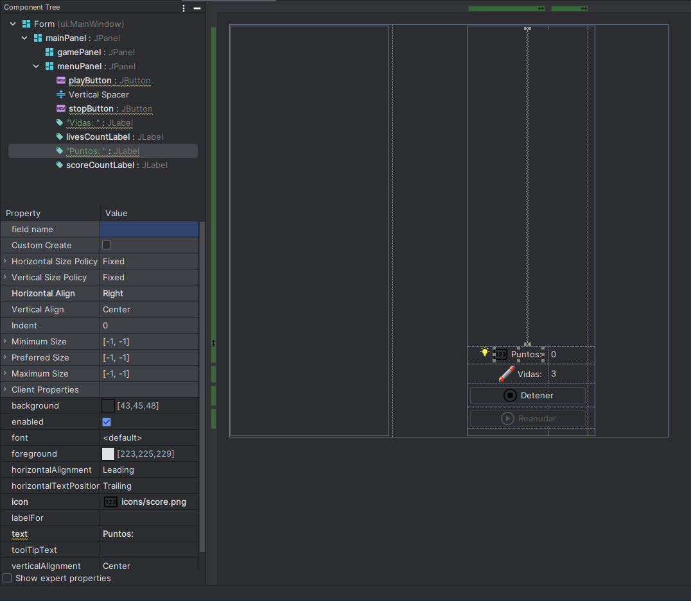

# MainWindow <Badge type="warning" text="Modificada" vertical="middle" />

Para nuestra ventana principal, deberemos de modificar nuestras etiquetas y botónes de tal manera que las etiquetas
muestren las vidas y los puntos del jugador, y los botónes deberán permitir activar o desactivar el juego, es decir
entrar en modo de pausa.

Por lo que debería de verse ahora de esta forma:


Como puedes ver usamos el atributo icon de 4 elementos para colocar imágenes como referente de su uso, es decir, el
contador de vidas, el puntaje, detener y reiniciar el juego.
Así mismo colocamos nombre a dos de las 4 etiquetas y a los dos botones:

- playButton
    - Es nuestro botón de reanudar
- stopButton
    - Es nuestro botón de stop
- livesCountLabel
    - Es la etiqueta que actualizamos cuando ganamos o perdemos una vida.
- scoreCountLabel
    - Es la etiqueta que se actualiza cada que se destruye un bloque.

En cuanto a la funcionalidad, nuestra clase agregará algunas funciones por lo que ahora se verá de esta forma:

:::: code-group
::: code-group-item Anterior

```java
package ui;

import util.Globals;

import javax.swing.*;

public class MainWindow extends JFrame {
    private JPanel mainPanel;
    private JPanel gamePanel;
    private JPanel menuPanel;
    private JButton button1;
    private JButton button2;

    public static void main(String[] args) {
        MainWindow window = new MainWindow("Prueba");
    }

    public MainWindow(String title) {

        super(title);
        this.add(mainPanel);
        this.menuPanel.setSize(Globals.MENU_DIMENSION);
        this.menuPanel.setPreferredSize(Globals.MENU_DIMENSION);
        this.menuPanel.setMinimumSize(Globals.MENU_DIMENSION);
        this.menuPanel.setMaximumSize(Globals.MENU_DIMENSION);
        this.pack();
        this.setLocationRelativeTo(null);
        this.setVisible(true);
        this.setResizable(false);
        this.setDefaultCloseOperation(EXIT_ON_CLOSE);
    }

    private void createUIComponents() {
        gamePanel = new GamePanel(this);
    }
}

```

:::
::: code-group-item ACTUALIZADO

```java{6-8,14-17,36-53,56-69,80-102}
package ui;

import util.Globals;

import javax.swing.*;
import java.awt.*;
import java.io.File;
import java.io.IOException;

public class MainWindow extends JFrame {
    private JPanel mainPanel;
    private JPanel gamePanel;
    private JPanel menuPanel;
    private JButton playButton;
    private JButton stopButton;
    private JLabel livesCountLabel;
    private JLabel scoreCountLabel;

    public static void main(String[] args) {
        MainWindow window = new MainWindow("Prueba");
    }

    public MainWindow(String title) {

        super(title);
        this.add(mainPanel);
        this.menuPanel.setSize(Globals.MENU_DIMENSION);
        this.menuPanel.setPreferredSize(Globals.MENU_DIMENSION);
        this.menuPanel.setMinimumSize(Globals.MENU_DIMENSION);
        this.menuPanel.setMaximumSize(Globals.MENU_DIMENSION);
        this.pack();
        this.setLocationRelativeTo(null);
        this.setVisible(true);
        this.setResizable(false);
        this.setDefaultCloseOperation(EXIT_ON_CLOSE);
        //Definimos un objeto de tipo fuente
        Font font;
        //Cambiamos todas las fuentes por la fuente de juego
        try {
            font = Font.createFont(Font.TRUETYPE_FONT,
                    new File("fonts\\game.ttf")).deriveFont(12f);
            changeFontRecursive(this, font);
        } catch (FontFormatException | IOException e) {
            e.printStackTrace();
        }
        stopButton.addActionListener(e -> {
            switchButtons();
            ((GamePanel) gamePanel).stopGame();
        });
        playButton.addActionListener(e -> {
            switchButtons();
            ((GamePanel) gamePanel).playGame();
        });
    }

    /**
     * Función que permite cambiar el tipo de fuente a todos los componentes de la ventana
     *
     * @param root Elemento raíz de interfaz
     * @param font Fuente a la cual se actualizarán los componentes
     */
    private void changeFontRecursive(Container root, Font font) {
        for (Component c : root.getComponents()) {
            c.setFont(font);
            if (c instanceof Container) {
                changeFontRecursive((Container) c, font);
            }
        }
    }

    public void switchButtons() {
        playButton.setEnabled(!playButton.isEnabled());
        stopButton.setEnabled(!stopButton.isEnabled());
    }

    private void createUIComponents() {
        gamePanel = new GamePanel(this);
    }

    public JPanel getGamePanel() {
        return gamePanel;
    }

    public void setGamePanel(JPanel gamePanel) {
        this.gamePanel = gamePanel;
    }

    public JLabel getLivesCountLabel() {
        return livesCountLabel;
    }

    public void setLivesCountLabel(JLabel livesCountLabel) {
        this.livesCountLabel = livesCountLabel;
    }

    public JLabel getScoreCountLabel() {
        return scoreCountLabel;
    }

    public void setScoreCountLabel(JLabel scoreCountLabel) {
        this.scoreCountLabel = scoreCountLabel;
    }
}
```

:::
::::
